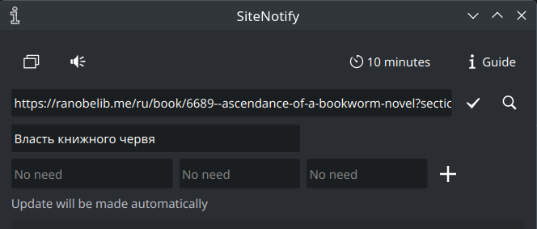
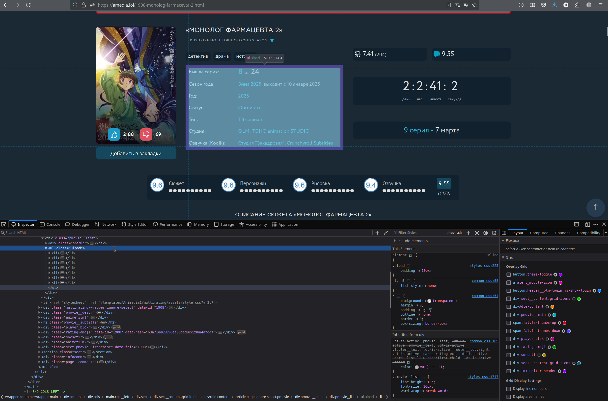
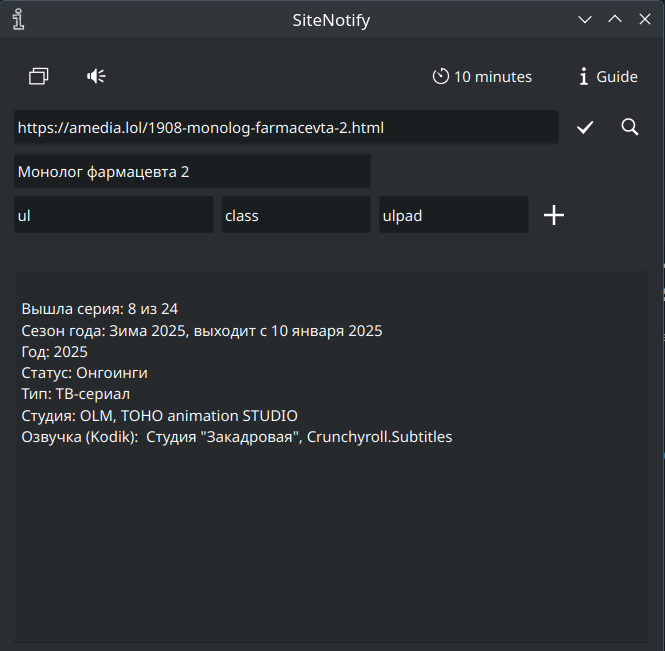
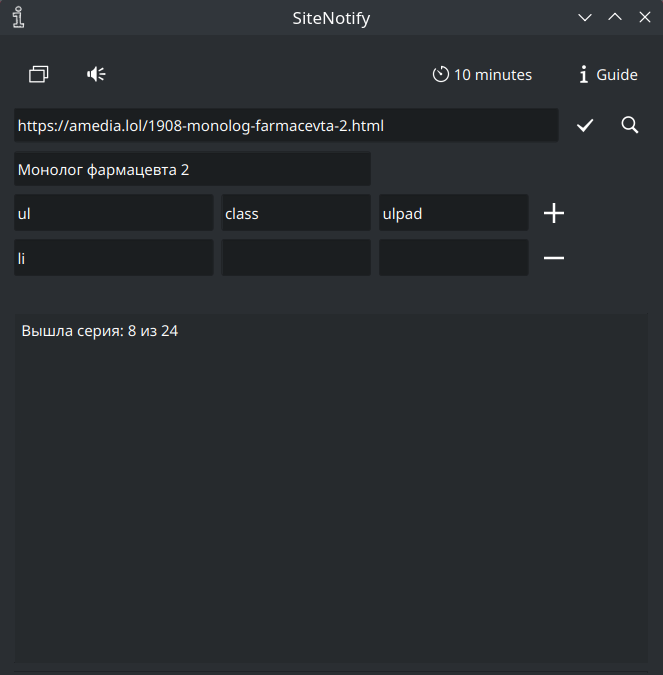

## Вступление

Добро пожаловать в SiteInform.\
Это приложение было создано для тех, кто любит посмотреть и почитать кучу одновременно выходящих тайтлов, но не любящих ежесекундно проверять, а вышла ли новая серия/глава? \
Равно это приложение создано для тех, чьи любимые произведения выходят раз в пол года, но кто все равно не может перестать следить за ними. \
Надеюсь оно будет вам полезно.\
Многое из написанного ниже очевидно для опытного пользователя ПК, но мне все же стоит объяснить некоторые вещи для тех, кто
никогда не занимался парсингом. Заранее прошу прощения.
  

## Интерфейс

Пробежимся по основным кнопкам:

\
Вкл/выкл отображение всплывающего уведомления о добавлении нового тайтла.

\
Вкл/выкл звуковой сигнал того же уведомления. (Он никак не связан с тем, которым плюется Windows по умолчанию. Для корректной работы 
приложения я бы даже советовал вам выключить звук уведомлений у данного приложения в настройках Windows)

\
Настройка промежутка времени между уведомлениями. Он установлен минимум на 10 минут не потому, что я такой злой,
а для того, чтобы не нагружать сверх меры сайты, на которых вы читаете или смотрите свои любимые произведения

\
Сохранение тайтла в программу для будущего отслеживания

\
Проверка парса сайта. В поле ниже вы увидите тут информацию, которую приложение будет оценивать на изменения. 
Данная опция по сути бесполезна, если вы добавляете в список страницу сайта, уже автоматизированного этим приложением для парсинга. 
Список таких сайтов ниже.

\
Удаление тайтла из приложения.
  

## Добавление сайтов (2 сценария)
 

### 1 сценарий
В этом сценарии ваш сайт находится в списке тех, что парсятся автоматически. Тогда вам нужно только вписать url и вы увидите следующую картинку:\

 

### Сайты, поддерживаемые автоматически:
- https://mangalib.me
- https://ranobelib.me
 

### 2 сценарий
В нем вы парсите неизвестный приложению сайт. В таком случае, если вы добавите его не используя дополнительных параметров, то проверяться
будет все содержимое сайта (его html текста) сразу.\
(При условии, что какая-то его часть не загружается отдельно с помощью json файлов.
Именно для парса таких случаев и предназначался 1 сценарий выше).\
Для парса только части сайта посмотрите html код страницы (кликните правой кнопкой мыши на нужный вам элемент и нажмите "Inspect").
В Firefox вы увидите следующую картинку, в другом браузере выглядеть оно будет иначе, но не суть.\
 \
Скопируйте параметры нужного вам элемента в приложение и нажмите на лупу. Вы увидите, что будет считывать 
приложение при проверке информации с этого сайта на обновления:\
 \
Нажав "+" и добавив еще параметров вы сможете обрезать количество сравниваемой информации еще сильнее. 
Часто бывает на сайте есть несколько элементов с одинаковым названием. К сожалению должен сказать, что функции проскока по ним пока-что нет,
но когда-нибудь обязательно будет.\
 \
 